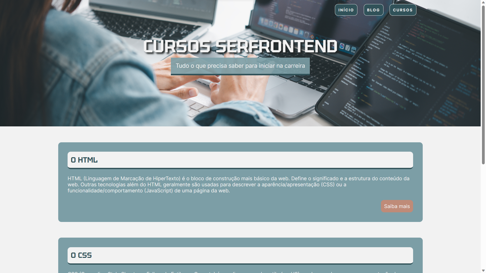

<h1 align="center"> Atividade de prática com CSS  </h1>

Atividade desenvolvida durante as aulas do projeto ElasNaTech 2023.  

  <a href="#-tecnologias">Tecnologias</a>&nbsp;&nbsp;&nbsp;|&nbsp;&nbsp;&nbsp;
  <a href="#-projeto">Projeto</a>&nbsp;&nbsp;&nbsp;

 

  

## 🚀 Tecnologias

Esse projeto foi desenvolvido com as seguintes tecnologias:

- HTML
- CSS
- Git e Github

## 💻 Projeto

Este projeto foi desenvolvido durante as aulas práticas de estrutura semântica e posicionamento com CSS.